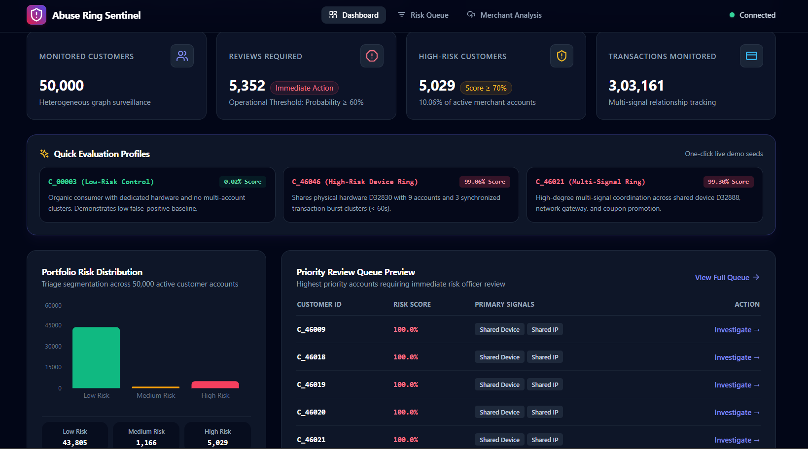
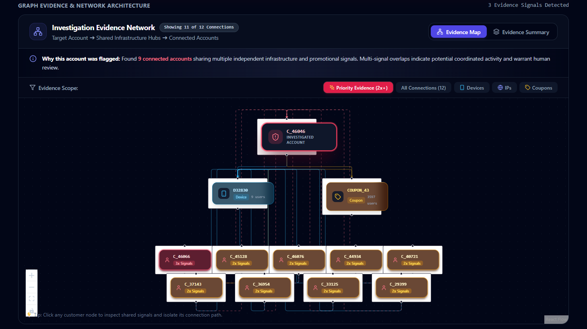
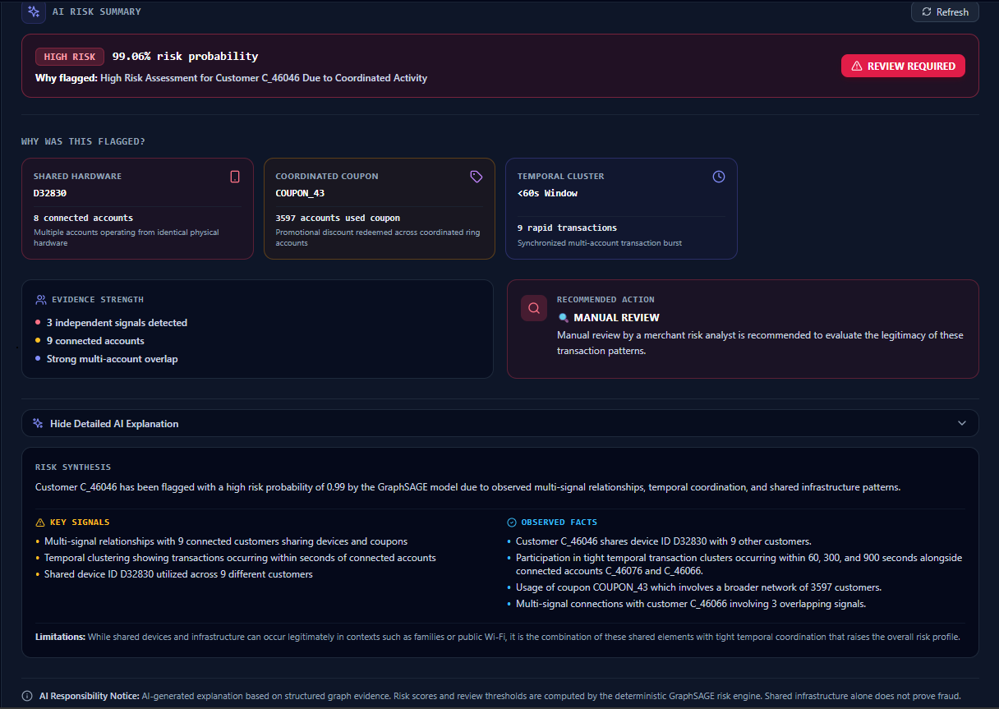
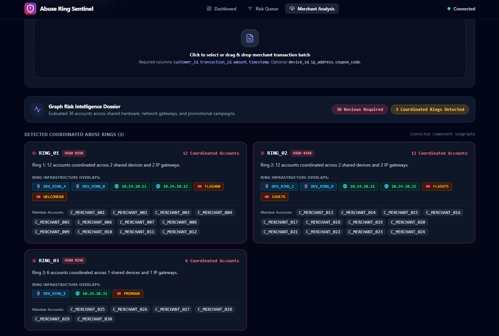
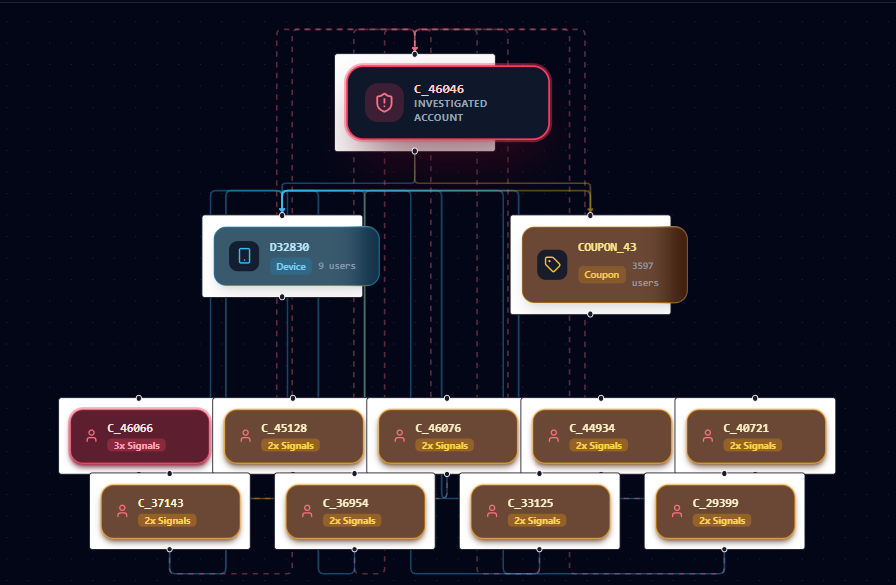
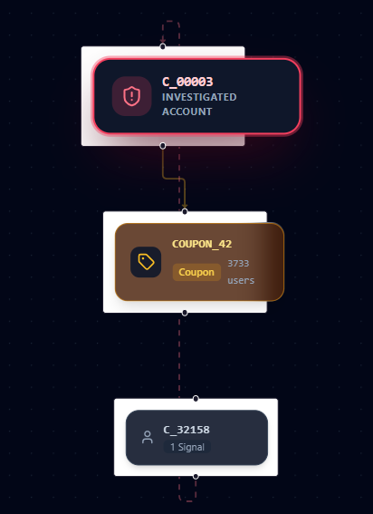
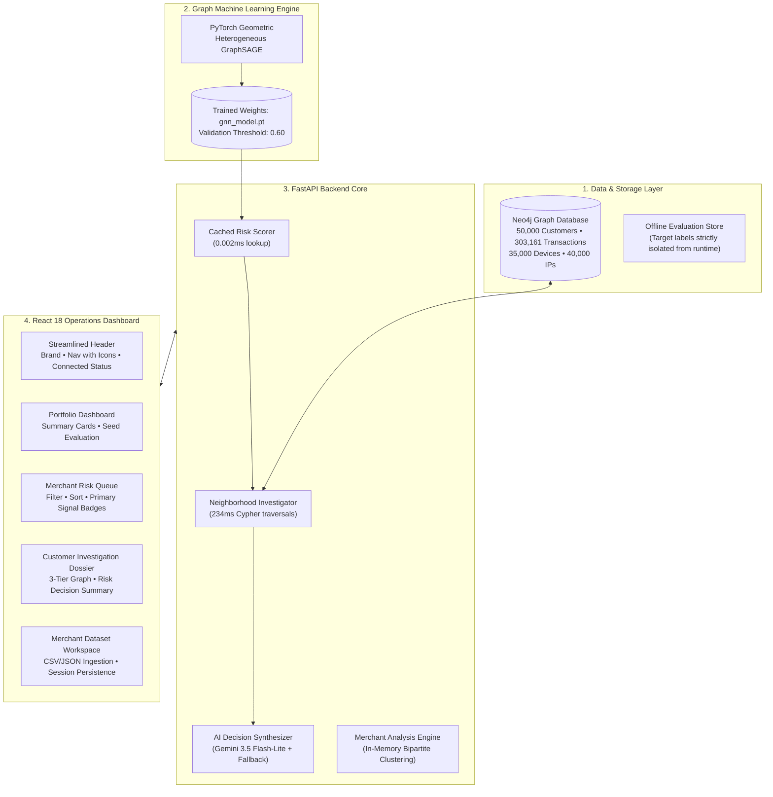

# 🛡️ Abuse Ring Sentinel

**Graph-Native Coordinated Abuse Detection & AI Risk Operations Platform**

*Developed for the Razorpay AI Buildathon 2026 — Track 02: AI Risk Manager*

[](https://razorpay.com)
[-emerald.svg)](#6-machine-learning-rigor--benchmarks)
[](#6-machine-learning-rigor--benchmarks)
[](#6-machine-learning-rigor--benchmarks)
[](#10-testing--verification-status)
[](#8-ground-truth-isolation--anti-leakage-defense)

> 📘 **Official Technical Presentation & System Walkthrough**:  
> **[View the Idea and walk through (Google Docs) ↗](https://docs.google.com/document/d/1fmLOq4i0qsnMCC7ckq3cZv-VJc5NDzHoL3KrTvfPXWw/edit?tab=t.0)**  

---

## ⚡ The 10-Second Executive Summary

### The Core Problem
Traditional payment fraud engines evaluate **isolated transactions** using tabular feature vectors (`amount`, `velocity_1h`, `card_bin`). While effective against stolen cards, this approach is **blind to coordinated abuse syndicates**—such as multi-account referral rings, promotional coupon farming, and merchant acquisition budget draining—where fraudsters distribute low-velocity transactions across dozens of synthetic accounts.

### The Solution
**Abuse Ring Sentinel** is a defense-only risk operations platform that treats coordinated fraud as a **topological connectivity problem**:
1. **Heterogeneous GraphSAGE (PyG)**: Learns multi-hop relational embeddings across accounts, hardware devices, IP gateways, coupons, and referral chains to achieve **73.7% F1 score** (+17.8 percentage points over tabular GBDT baselines).
2. **Sub-Second Neo4j Evidence Traversal (234ms)**: Extracts multi-signal structural coordination facts without tabular opacity.
3. **3-Second Scannable AI Risk Summary**: Synthesizes complex graph topologies into plain-English operational directives using Google Gemini, backed by an instant deterministic fallback engine.
4. **Merchant Dataset Analysis Workspace**: Allows external merchants to upload transaction batches (CSV, JSON, JSONL) into an isolated session namespace for instantaneous in-memory abuse ring clustering.

```text
    TRADITIONAL TABULAR MODEL                   ABUSE RING SENTINEL (GRAPH-NATIVE)
   (Evaluates Users in Isolation)               (Reveals Topological Coordination)

      [User A] ──► Low velocity (Pass)                 [User A]
      [User B] ──► Normal order (Pass)                /        \
      [User C] ──► Small amount (Pass)          (Device D99)   (Network IP 10.4.1)
                                                      \        /
  Result: ₹8.08L+ Lost to Syndicate                    [User B] ────── [User C]
                                                           │
                                                      (Promo Code)
                                              Result: Coordinated Ring Flagged (99.1%)
```

---

## 📸 Visual Tour & Application Screenshots

> *Note for Evaluators: Place captured PNG screenshots into the `docs/assets/` directory matching the filenames below.*

### 1. Executive Portfolio Risk Dashboard
*Real-time visibility across 50,000 customers, 303,161 transactions, calibrated risk distribution, and 1-click evaluation controls.*


*Recommended capture: `http://localhost:3000/` showing top portfolio metric cards, calibrated distribution, and Quick Evaluation controls.*

---

### 2. The 3-Tier Visual Evidence Graph
*Interactive radial canvas mapping Target Customer → Shared Infrastructure Hubs → Connected Peer Accounts with an integrated Node Inspector Drawer.*


*Recommended capture: `http://localhost:3000/customers/C_46046` scrolled to the NetworkGraph canvas with a node selected in the inspector drawer.*

---

### 3. Redesigned AI Risk Decision Summary (3-Second Scannability)
*Engineered for cognitive scannability: Risk Decision Banner → 4 Modular Evidence Cards → Evidence Strength → Clear Operational Action.*


*Recommended capture: `http://localhost:3000/customers/C_46046` showing the redesigned `AIExplanationCard` with `View AI Explanation Details` expanded.*

---

### 4. Merchant Dataset Analysis Workspace
*Self-serve merchant batch ingestion (CSV/JSON/JSONL) with automated schema validation, session isolation, and in-memory ring clustering.*


*Recommended capture: `http://localhost:3000/merchant-analysis` after loading `Batch A: Multi-Account Promo Abuse Ring`.*

---

### 5. High-Risk Abuse Ring (`C_46046`) vs. Low-Risk Control (`C_00003`)
*Definitive empirical comparison proving that Sentinel flags coordinated syndicates while leaving organic consumer behavior unpenalized.*

| Coordinated Abuse Ring (`C_46046`) | Legitimate Organic Customer (`C_00003`) |
| :---: | :---: |
|  |  |
| **GNN Score: 99.06% • REVIEW REQUIRED** | **GNN Score: 0.02% • ROUTINE ACCOUNT** |
| Shares device `D32830` with **9 accounts**, IP `172.26.132.41` with **5 accounts**, and synchronized transaction bursts ($<60\text{s}$). | Dedicated hardware fingerprint, private residential gateway, natural order spacing, and zero multi-account overlaps. |

---

## 🎯 Why This Matters: The Merchant & Risk-Analyst Perspective

### 1. Eliminating False Review Overhead (-52.8% False Positives)
In high-volume e-commerce and fintech checkout environments, manual review operations are expensive (modeled at ₹1,000 / review). Tabular fraud models flag hundreds of benign users whose purchase velocities spike organically during sales. Sentinel's graph verification reduces false positive review queues from **867 cases down to 409 cases**, saving ₹4.58L in operational overhead per evaluation cohort.

### 2. Stopping Coordinated Budget Drainage (-44.9% Missed Fraud)
Syndicates deploy automated scripts to claim first-order discounts and signup bonuses across hundreds of accounts. By aggregating relational signals (device, IP, temporal bursts, and promo codes), GraphSAGE catches **35 additional syndicate rings** missed by baseline models, preventing ₹3.50L in direct loss.

### 3. The 3-Second Cognitive Scannability Goal
When an analyst opens an alert, they should not have to parse an unstructured paragraph or inspect raw embeddings. Sentinel's redesigned decision hierarchy answers 4 questions within 3–5 seconds:
* **Is this customer risky?** → `HIGH RISK — 99.06%`
* **Why was it flagged?** → `Shared Device D32830 + IP 172.26.132.41 + Coordinated Coupon`
* **How strong is the evidence?** → `3 independent signals • 9 connected accounts • Strong multi-account overlap`
* **What should the merchant do?** → `🔍 MANUAL REVIEW: Review connected accounts before fulfillment`

---

## 🏗️ System Architecture & Data Flow



---

## 🔄 End-to-End Component Workflow

### 1. Data Layer: Heterogeneous Graph Schema (Neo4j)
Sentinel represents commerce transactions as a heterogeneous network connecting:
* `(Customer)-[:USES_DEVICE]->(Device)`
* `(Customer)-[:USES_IP]->(IP)`
* `(Customer)-[:USED_COUPON]->(Coupon)`
* `(Customer)-[:MADE]->(Transaction)`
* `(Customer)-[:REFERRED]->(Customer)`

### 2. Graph Neural Network Inference (PyTorch Geometric)
* **Model**: 2-layer `HeteroGraphSAGE` with relational `SAGEConv` layers and mean aggregation.
* **Node Feature Vector**: Behavioral features (transaction count, total volume, average order value, coupon usage count, night transaction ratio, account age).
* **Message Passing**: Embeddings from shared devices, IPs, and peer accounts propagate multi-hop relational context into the customer node.

### 3. Decoupled Risk Metrics Architecture
To maintain clear operational semantics, the system strictly separates:
* **`risk_probability`**: Continuous model probability output ($[0.0, 1.0]$) representing structural coordination likelihood.
* **`review_required`**: Deterministic boolean flag triggered when `risk_probability >= 0.60`.
* **`risk_level`**: Qualitative operational tier (`LOW` $< 0.30$, `MEDIUM` $0.30 - 0.69$, `HIGH` $\ge 0.70$).

### 4. Deterministic Evidence Extraction (Phase 4 Engine)
When a customer is investigated, the backend executes 6 parameterized Cypher subqueries in parallel ($234\text{ ms}$) to extract:
* Shared device reuse counts and other customer IDs.
* Shared IP subnet clustering.
* Promotional coupon coordination across shared hardware.
* Temporal transaction bursts ($\le 60\text{s}$ interval).
* Referral tree in-degree, out-degree, and component size.

### 5. AI Risk Decision Summary Layer (Gemini 3.5 Flash-Lite)
* Synthesizes the structured evidence package into a calibrated JSON schema (`headline`, `key_signals`, `observed_evidence`, `recommended_action`, `uncertainty`).
* **Fault-Tolerant Deterministic Fallback**: If the Gemini API experiences network timeouts or missing credentials, a local Python synthesis engine automatically generates a structured decision summary in $< 1\text{ ms}$, ensuring 100% uptime.

---

## 📊 Machine Learning Rigor & Benchmarks

All metrics reflect empirical evaluation on the held-out test split ($N = 7,517$ test customers; abuse prevalence = $8.99\%$).

### A. Model Performance vs. Tabular Baseline

| Metric | Tabular GBDT Baseline | Heterogeneous GraphSAGE | Absolute Difference |
| :--- | :---:| :---:| :---:|
| **Precision** | 0.4082 | **0.6075** | **+19.93 pp** |
| **Recall** | 0.8846 | **0.9364** | **+5.18 pp** |
| **F1 Score** | 0.5586 (55.9%) | **0.7369 (73.7%)** | **+17.8 percentage points** |
| **PR-AUC** | 0.7945 | **0.9337** | **+13.93 pp** |
| **ROC-AUC** | 0.9599 | **0.9883** | **+2.84 pp** |
| **False Positives (Review Ops Waste)** | 867 cases | **409 cases** | **-458 unnecessary reviews (-52.8%)** |
| **False Negatives (Missed Fraud)** | 78 cases | **43 cases** | **-35 missed fraud attacks (-44.9%)** |

### B. Business Cost Evaluation (₹1,000 Review / ₹10,000 Fraud Loss)

| Cost Category | Tabular GBDT Baseline | Heterogeneous GraphSAGE | Operational Net Savings |
| :--- | :---:| :---:| :---:|
| **Review Operations Overhead** | ₹8,67,000.00 | **₹4,09,000.00** | ₹4,58,000.00 saved |
| **Uncaught Fraud Losses** | ₹7,80,000.00 | **₹4,30,000.00** | ₹3,50,000.00 saved |
| **Total Expected Operational Cost** | ₹16,47,000.00 | **₹8,39,000.00** | **₹8,08,000.00 saved (-49.06%)** |

### C. System Latency Profile ($N = 50$ Operations)
* **Cached GNN Probability Lookup**: **0.002 ms** (mean) / **0.003 ms** (p95)
* **Neo4j Graph Investigation (6 subqueries)**: **233.93 ms** (mean) / **531.61 ms** (p95)
* **Full Investigation API Endpoint**: **248.93 ms** (mean) / **551.61 ms** (p95)
* **Gemini AI Explanation Generation**: **6.36 s** (mean) / **11.94 s** (p95)

---

## 💼 Merchant Dataset Analysis Workspace

The **Merchant Dataset Analysis Workspace** demonstrates how real-world merchants can provide transaction batches to Abuse Ring Sentinel for topological analysis:

```text
External Merchant Batch (CSV / JSON / JSONL)
                    │
                    ▼  POST /api/analysis/upload
      [Anti-Leakage Validation Guard]
     (Rejects forbidden target labels)
                    │
                    ▼
       [Session Workspace Isolation]
    (Stores records in UUID session namespace)
                    │
                    ▼
         [In-Memory Graph Builder]
     (Bipartite customer-device-IP projection)
                    │
                    ▼
     [BFS Connected Component Clustering]
   (Discovers coordinated multi-account rings)
                    │
                    ▼
   [Dedicated Customer Investigation View]
  (Interactive graph & Risk Decision Summary)
```

### Key Workspace Capabilities:
1. **Strict Session Isolation**: Uploaded datasets exist in standalone session namespaces (`session_id = UUID4`). They **never** mutate or contaminate the frozen reference Neo4j graph or seeded profiles (`C_00003`, `C_46046`).
2. **Session Persistence**: Active session IDs are synced to URL query parameters (`?session=...`) and `sessionStorage`. Navigating back and forth between customer dossiers and the workspace automatically preserves all uploaded records and analysis results.
3. **Curated Demo Batches for Evaluators**:
   * **Batch A (Promo Ring)**: 10 customer accounts, 2 shared devices, 1 shared IP, coordinated coupon exploitation.
   * **Batch B (Organic Retail)**: 5 legitimate retail accounts with dedicated hardware and standard spacing.
   * **Security Test**: Hostile upload containing target labels (`is_abuse`, `ring_id`) demonstrating immediate automated rejection.

---

## 🛡️ Ground-Truth Isolation & Anti-Leakage Defense

Abuse Ring Sentinel enforces strict academic and operational anti-leakage principles:

1. **Zero Target Labels in Graph Database**: Neo4j contains **zero** target labels (`is_abuse`, `ring_id`, `abuse_type`). All ground-truth annotations are stored in isolated offline files used strictly during model training.
2. **Temporal Snapshot Boundary**: Feature extractors and neighborhood queries strictly enforce `timestamp <= cutoff_time`, guaranteeing that future events cannot leak into historical risk evaluations.
3. **Automated Runtime Leakage Scanner**: An automated audit script (`backend/scripts/audit_leakage.py`) scans all 38 production files across backend, ML, API, and frontend routes. **Audit Result: 0 leaks found**.
4. **Merchant Upload Anti-Leakage Guard**: Any uploaded merchant batch containing target labels is rejected immediately with an HTTP 422 error.

---

## 🚀 Guided 2-Minute Demo Flow for Reviewers

To evaluate Abuse Ring Sentinel end-to-end:

### Scenario 1: Evaluating the Seeded Demo Controls
1. Open **`http://localhost:3000`** in your browser.
2. Notice the clean top-level portfolio metrics and the frozen review threshold ($\ge 0.60$).
3. In the **Quick Evaluation Controls** section:
   * Click **`C_00003 (Low-Risk)`**:
     * Score: **0.02% GNN Score** • **`ROUTINE ACCOUNT`**.
     * Verified organic referral, dedicated hardware, zero cross-account sharing.
     * Recommended Action: `✅ APPROVE / ROUTINE CLEARANCE`.
   * Click **`C_46046 (High-Risk)`**:
     * Score: **99.06% GNN Score** • **`REVIEW REQUIRED`**.
     * Observe the **3-Second Risk Decision Summary**: Shared device `D32830` (9 connected accounts), shared IP `172.26.132.41` (5 accounts), coordinated coupon `COUPON_43`, and $<60\text{s}$ transaction burst.
     * Click **`View AI Explanation Details →`** to read the Gemini-synthesized narrative.
     * Interact with the **Evidence Network Graph**: Pan, zoom, and click nodes to open the Node Inspector Drawer.

### Scenario 2: Testing the Merchant Dataset Analysis Workspace
1. Click **`Merchant Analysis`** in the primary navigation bar.
2. Under **Quick Demo Test Datasets**, click **`Batch A: Multi-Account Promo Abuse Ring`** (or drag-and-drop your own CSV/JSON).
3. Review the **Dataset Validation Dossier**: Entity counts (10 customers, 2 devices, 1 IP, 1 coupon) and density warnings.
4. Review the **Detected Abuse Rings** section: Observe detected ring cluster `D_RING_99`.
5. In the **Session Customer Risk Queue**, click **`Inspect Graph →`** on customer `M_1001`:
   * You will be routed to a dedicated customer investigation page (`/merchant-analysis/sessions/.../customers/M_1001`).
   * Review the complete interactive evidence graph and Risk Decision Summary extracted from the uploaded session batch.
   * Click **`← Back to Merchant Analysis Workspace`** to confirm that the session and uploaded data are automatically restored without re-uploading.

---

## 🛠️ Local Setup & Installation

### Prerequisites
* **Python**: 3.10+ (tested on Python 3.13)
* **Node.js**: v18+ & npm
* **Docker & Docker Compose**: For running Neo4j
* **Google Gemini API Key**: *(Optional; deterministic fallback operates automatically if omitted)*

---

### Step 1: Clone Repository
```bash
git clone https://github.com/Krishna18113/abuse_ring_sentinel.git
cd abuse_ring_sentinel
```

---

### Step 2: Start Neo4j Graph Database
```bash
docker-compose up -d
```
* **Browser Console**: [http://localhost:7474](http://localhost:7474) (User: `neo4j`, Password: `testpassword123`)
* **Bolt Protocol**: `bolt://localhost:7687`

---

### Step 3: Backend Setup
```bash
cd backend
python -m venv venv

# Activate Virtual Environment:
# Windows:
.\venv\Scripts\activate
# Linux/macOS:
source venv/bin/activate

# Install Dependencies
python -m pip install -r requirements.txt
```

*(Optional) Create `backend/.env` for custom credentials:*
```env
NEO4J_URI=bolt://localhost:7687
NEO4J_USERNAME=neo4j
NEO4J_PASSWORD=testpassword123
GEMINI_API_KEY=your_gemini_api_key_here
```

---

### Step 4: Seed Data Ingestion (One-Time Setup)
If running against a clean Neo4j container, generate and ingest the reference dataset:
```bash
# Generate reference synthetic dataset (50,000 customers, 303,161 transactions)
python -m app.data.generate --seed 42

# Ingest into Neo4j in parameterized UNWIND batches
python -m app.graph.ingest --data-dir data/generated/
```

---

### Step 5: Start Backend API
```bash
# From backend/ directory with venv activated:
uvicorn app.api.app:app --reload --port 8000
```
* **Interactive API Docs (Swagger)**: [http://localhost:8000/docs](http://localhost:8000/docs)
* **Health Endpoint**: [http://localhost:8000/api/health](http://localhost:8000/api/health)

---

### Step 6: Start Frontend Application
Open a new terminal window:
```bash
cd frontend
npm install
npm run dev
```
* **Operations Dashboard**: [http://localhost:3000](http://localhost:3000)

---

## 🧪 Testing & Verification Status

### 1. Pytest Backend Test Suite (19 / 19 Passed)
```bash
cd backend
python -m pytest tests/test_api.py tests/test_analysis.py -v
```
* Validates health endpoints, dashboard aggregations, risk queue filtering, graph schemas, Gemini failover, merchant batch parsing (CSV, JSON, JSONL), ground-truth rejection, session isolation, and in-memory ring clustering.

### 2. Automated Anti-Leakage Audit (0 Leaks Found)
```bash
cd backend
python scripts/audit_leakage.py
```
* Scans all 38 production runtime files across `risk/`, `ai/`, `api/`, and `frontend/` to ensure zero target label leakage.

### 3. Frontend Production Build (0 TypeScript Errors)
```bash
cd frontend
npm run build
```
* Compiles all components and pages via `tsc && vite build` cleanly in production mode.

---

## 📁 Repository Structure

```text
abuse_ring_sentinel/
├── backend/
│   ├── app/
│   │   ├── ai/              # Gemini 3.5 service, prompts, schemas, fallback logic
│   │   ├── analysis/        # Merchant Dataset Analysis engine & in-memory clusterer
│   │   ├── api/             # FastAPI routers, schemas, and endpoint coordinators
│   │   ├── data/            # Synthetic generator (50k customers, 303k tx) & checks
│   │   ├── graph/           # Neo4j connection, schema constraints, UNWIND batch ingestion
│   │   ├── ml/              # Heterogeneous GraphSAGE, feature extraction, evaluation
│   │   └── risk/            # Graph evidence extraction & cached risk scorer
│   ├── artifacts/           # Trained model weights (gnn_model.pt, metrics.json)
│   ├── scripts/             # Latency benchmarks, leakage audits, failure tests
│   └── tests/               # 19 Pytest integration tests (test_api.py, test_analysis.py)
├── docs/
│   ├── assets/              # Recommended directory for README screenshots
│   └── MERCHANT_DATASET_ANALYSIS.md # Merchant upload architecture specification
├── frontend/
│   ├── src/
│   │   ├── components/      # AIExplanationCard, NetworkGraph, RiskBadge, EvidenceTimeline
│   │   ├── pages/           # Dashboard, RiskQueue, Investigation, MerchantAnalysis
│   │   ├── services/        # Typed API clients (api.ts)
│   │   └── types/           # TypeScript interface definitions
│   └── package.json
├── docker-compose.yml       # Neo4j Community Edition container definition
├── PHASE_7_VALIDATION.md    # Official empirical validation report
└── README.md                # Project documentation
```

---

## 🏆 Buildathon Context & Prospective Roadmap

* **Event**: **Razorpay AI Buildathon 2026**
* **Track**: **Track 02: AI Risk Manager**
* **Core Problem Addressed**: Detecting coordinated multi-account abuse syndicates and promotional rings that evade per-transaction tabular fraud filters.

### Future Architectural Extensions (Roadmap)
The following capabilities represent prospective roadmap items beyond the current buildathon implementation:
* [ ] **Continuous Streaming Ingestion**: Integrating Apache Kafka or AWS Kinesis to update graph neighborhood topologies on streaming merchant authorization events.
* [ ] **Dynamic GNN Inductive Mini-Batching**: Implementing PyG neighbor loaders for on-the-fly mini-batch inference directly inside merchant checkout flows.
* [ ] **Collaborative Multi-Merchant Ring Linking**: Privacy-preserving federated graph hashing to detect syndicates operating across multiple independent Razorpay merchants without exposing raw customer PII.
* [ ] **Automated Merchant Policy Engine**: Rule-builder allowing merchants to define custom automated actions (e.g., require 3DS, disable COD, or limit coupon redemptions) based on graph coordination confidence.

---

## 📜 License

Distributed under the MIT License for evaluation in the **Razorpay AI Buildathon 2026**.
