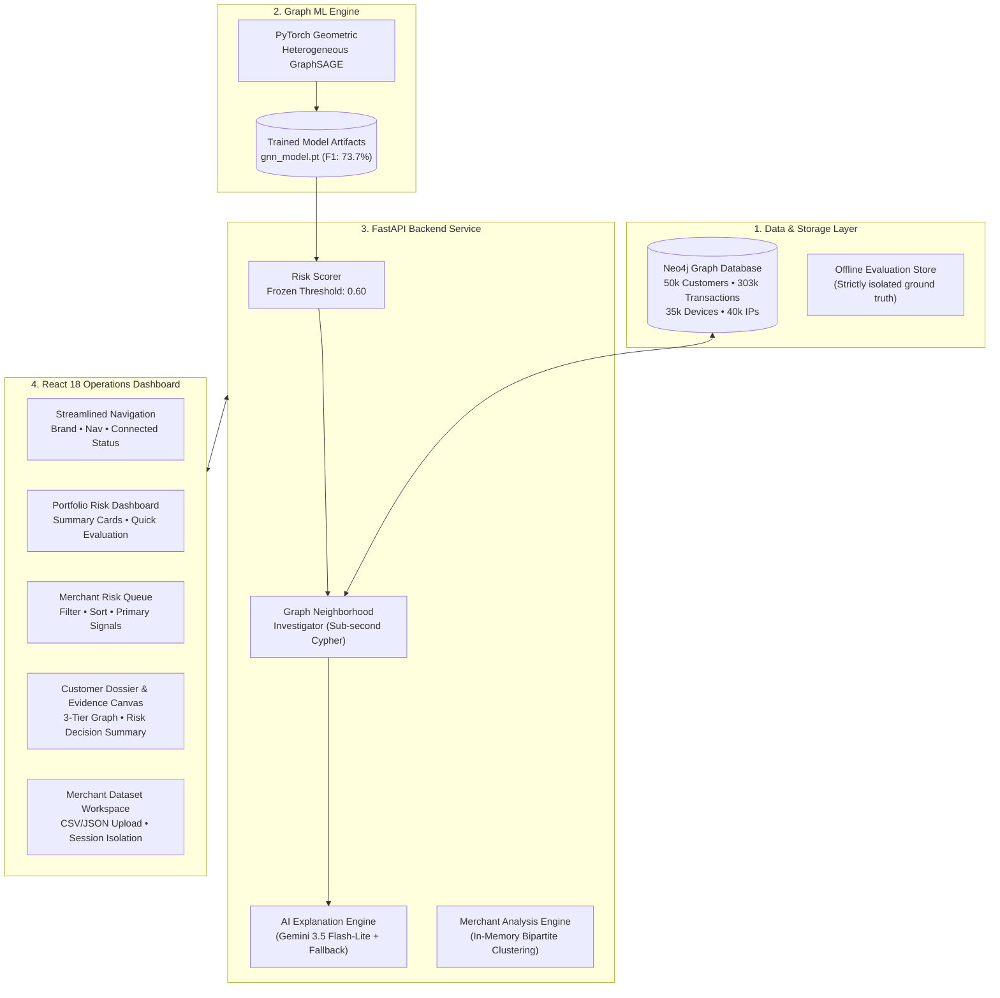
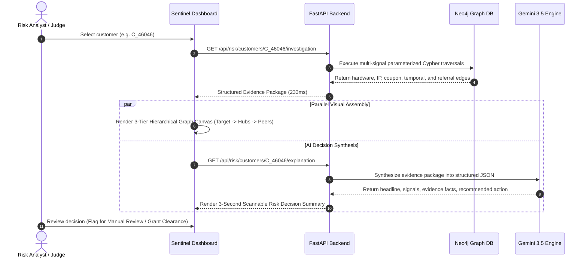

# Abuse Ring Sentinel

**Graph-Native Coordinated Abuse Detection & AI Risk Operations Platform**

*Developed for the Razorpay AI Buildathon 2026 — Track 02: AI Risk Manager*

---

## 1. Project Overview

**Abuse Ring Sentinel** is an end-to-end fraud investigation platform designed to detect, visualize, and explain **coordinated multi-account abuse rings** in merchant payments and digital commerce.

Unlike isolated transaction fraud (such as stolen card testing), promotional abuse and referral syndicates operate across distributed networks of seemingly distinct customer accounts that secretly share physical hardware, IP gateways, promotional codes, and referral links. Traditional per-transaction rules and tabular machine learning models evaluate transactions in isolation, leaving them blind to the topological coordination connecting abusive rings.

Abuse Ring Sentinel pairs a **Heterogeneous Graph Neural Network (GraphSAGE)** with **Neo4j graph evidence extraction**, an **interactive multi-tier visual evidence canvas**, and a **Gemini-powered Risk Decision Summary layer** to give merchant risk analysts instant, actionable clarity.

```text
  Individual Accounts                    Coordinated Ring Structure
       (Isolated)                          (Detected by Sentinel)

        [User A]                                   [User A]
                                                   /      \
        [User B]          ───────►         (Device)        (Network IP)
                                                   \      /
        [User C]                                   [User B] ──── [User C]
                                                       │
                                                   (Promo Code)
```

---

## 2. The Problem: The Topological Blindspot of Payment Fraud

Traditional fraud engines evaluate individual transactions using tabular feature vectors (e.g., `amount`, `hour_of_day`, `card_bin`, `velocity_1h`). While effective for payment card fraud, this approach fails against coordinated syndicates:

1. **Synthetic & Distributed Identities**: Ring operators create dozens of distinct customer accounts using different emails and phone numbers.
2. **Sub-Threshold Transaction Velocity**: Each individual account transacts below standard rate-limiting thresholds (e.g., 1 order per account per campaign), avoiding velocity rules.
3. **Exploitation of Promotional Capital**: Merchant acquisition budgets (first-order discounts, referral credits, signup bonuses) are drained systematically.
4. **Analyst Burnout & Explainability Gap**: Even when rules flag suspicious transactions, analysts receive opaque risk scores without structural evidence, forcing them to manually cross-reference logs across multiple databases.

---

## 3. The Solution: Graph-Native Defense & Decision Intelligence

Abuse Ring Sentinel treats payment fraud as a **structural connectivity problem**:

* **GraphSAGE on Heterogeneous Graphs**: Captures multi-hop neighborhood coordination across customers, hardware devices, IP addresses, coupons, and referral edges.
* **Deterministic Sub-Second Evidence Extraction**: Traverses graph neighborhoods in Neo4j to extract concrete, observable facts (e.g., *“shares physical hardware with 9 accounts and transacted in a 42-second burst”*).
* **3-Second Scannable AI Risk Summary**: Synthesizes complex graph topologies into plain-English operational directives using Google Gemini, backed by an offline deterministic fallback engine.
* **Merchant Dataset Analysis Workspace**: Enables external merchants to upload raw transaction/customer batches (CSV, JSON, JSONL) into an isolated session namespace for instantaneous abuse ring clustering and investigation.

---

## 4. Key Differentiators

| Capability | Traditional Rules / Tabular ML | Abuse Ring Sentinel |
| :--- | :--- | :--- |
| **Detection Scope** | Single transaction / isolated user | Multi-account topological rings |
| **Model Architecture** | Tabular GBDT (XGBoost / LightGBM) | **Heterogeneous GraphSAGE (PyG)** |
| **Model F1 Score** | 55.9% | **73.7% (+17.8 percentage points)** |
| **Operational Cost** | ₹16,47,000 (baseline test split) | **₹8,39,000 (-49.1% operational cost)** |
| **Evidence Presentation** | Tabular feature weights / SHAP values | **Interactive 3-tier evidence graph** |
| **Analyst Explanation** | Opaque numerical probability | **Evidence-grounded Risk Decision Summary** |
| **External Integration** | Complex ETL pipelines required | **Self-serve merchant upload workspace** |
| **Target Leakage Defense** | Manual schema reviews | **Automated runtime anti-leakage guards** |

---

## 5. System Architecture



---

## 6. End-to-End Investigation Lifecycle



---

## 7. Core Platform Features

### A. Executive Portfolio Dashboard
* **Portfolio Risk Metrics**: Total indexed customers (50,000), total transactions (303,161), customers requiring review, and risk tier distribution (Low / Medium / High).
* **Calibrated Risk Distribution**: Visual breakdown of portfolio risk with an operational review threshold frozen at **$\ge 0.60$**.
* **Quick Evaluation Seed Controls**: 1-click evaluation access to control customer profiles (`C_00003` low-risk baseline and `C_46046` coordinated abuse ring).

### B. Merchant Risk Queue
* **Filterable & Sortable Investigation Queue**: Real-time filtering by risk tier (`HIGH`, `MEDIUM`, `LOW`), review requirement, probability range, and customer search.
* **Observable Signal Badges**: Each queue row highlights detected primary signals (Shared Device, Shared IP, Referral Link, Temporal Burst) before opening the full investigation.

### C. Evidence-First Network Graph Canvas
* **3-Tier Radial Hierarchy**:
  * **Tier 1 (Target Node)**: Center focal customer.
  * **Tier 2 (Infrastructure Hubs)**: Shared devices (phone/laptop), network IP gateways, and promotional coupons.
  * **Tier 3 (Connected Peer Accounts)**: Coordinate ring members linked across multiple infrastructure hubs.
* **Visual Inspector Drawer**: Clicking any node opens a deep-dive inspection panel displaying entity IDs, degree centrality, transaction counts, and connection reasons.
* **Canvas Controls**: Interactive zoom, pan, fit-to-screen, and mini-map navigation.

### D. Redesigned AI Risk Decision Summary (3-Second Scannability)
The AI explanation section is engineered for immediate cognitive scannability:
1. **Top-Level Decision Header**: Risk level badge, exact probability (e.g., `99.06%`), review required alert, and a single-sentence reason.
2. **Why Was This Flagged? Grid**: 4 concise, modular evidence cards answering *“What signal was observed?”* and *“What does it mean?”*
   * 📱 **Shared Hardware**: Target device ID • connected accounts count • hardware reuse interpretation.
   * 🌐 **Shared Network IP**: Target IP gateway • connected accounts count • network clustering interpretation.
   * 🎟 **Coordinated Coupon**: Promo code ID • multi-account redemptions • campaign exploitation interpretation.
   * ⏱ **Temporal Cluster**: Burst window ($<60\text{s}$) • rapid transaction count • synchronization interpretation.
3. **Evidence Strength Summary**: Compact count of independent signals, connected accounts, and structural overlap confidence.
4. **Recommended Action**: Bold operational directive (`🔍 MANUAL REVIEW` vs. `✅ APPROVE / ROUTINE CLEARANCE`).
5. **Collapsible AI Details (`View AI Explanation Details →`)**: Expanding reveals the full natural-language synthesis narrative, observable facts, and model uncertainty.
6. **Secondary Responsibility Notice**: Clear transparency disclaimer confirming deterministic risk scoring.

### E. Merchant Dataset Analysis Workspace
Enables external merchants to upload and evaluate their own datasets without touching production Neo4j data:
* **Multi-Format Ingestion**: Supports CSV, JSON, and JSONL formats with auto-detection.
* **Schema Validation & Entity Extraction**: Validates mandatory fields (`customer_id`, `transaction_id`, `amount`, `timestamp`) and extracts optional infrastructure identifiers (`device_id`, `ip_address`, `coupon_id`).
* **In-Memory Graph Clustering**: Constructs bipartite graph projections in memory and executes connected-component BFS algorithms to uncover coordinated rings within seconds.
* **Session Persistence & Restoration**: Sessions are stored under isolated UUID namespaces, synced with URL query parameters (`?session=...`) and `sessionStorage`, allowing frictionless navigation back and forth between customer dossiers and the workspace.
* **Curated Evaluation Batches**:
  * **Batch A (Promo Ring)**: 10 customer accounts, 2 shared devices, 1 shared IP, coordinated coupon exploitation.
  * **Batch B (Organic Retail)**: 5 legitimate retail accounts, dedicated devices, and standard purchase cadence.
  * **Security Test**: Hostile batch containing target labels (`is_abuse`, `ring_id`) to verify immediate automated rejection.

---

## 8. Machine Learning Pipeline & Empirical Benchmarks

### A. Graph Neural Network Architecture
* **Framework**: PyTorch Geometric (PyG).
* **Model**: Heterogeneous GraphSAGE (`HeteroGraphSAGE`) utilizing multi-relation `SAGEConv` layers and mean aggregation.
* **Node Types**: `Customer`, `Device`, `IP`, `Coupon`.
* **Edge Types**: `(Customer)-[:USES_DEVICE]->(Device)`, `(Customer)-[:USES_IP]->(IP)`, `(Customer)-[:USED_COUPON]->(Coupon)`, `(Customer)-[:REFERRED]->(Customer)`.
* **Features**: Customer behavioral footprint (transaction count, total volume, average order value, coupon usage frequency, night transaction ratio, account age) combined with relational neighborhood embeddings.

### B. Benchmark Results (Held-Out Test Set: $N = 7,517$ Customers)

```text
       Precision / Recall Tradeoff (Held-Out Test Set)

   1.0 ┌────────────────────────────────────────────────────────┐
       │                                         ● GraphSAGE    │
   0.8 │                                    (R: 93.6%, P: 60.8%)│
R      │                                                        │
e  0.6 │                              ● Baseline GBDT           │
c      │                         (R: 88.5%, P: 40.8%)           │
a  0.4 │                                                        │
l      │                                                        │
l  0.2 │                                                        │
       │                                                        │
   0.0 └────────────────────────────────────────────────────────┘
       0.0         0.2         0.4         0.6         0.8    1.0
                              Precision
```

| Metric | Tabular GBDT Baseline | Heterogeneous GraphSAGE | Impact |
| :--- | :---:| :---:| :---:|
| **Precision** | 0.4082 | **0.6075** | **+19.93 pp** |
| **Recall** | 0.8846 | **0.9364** | **+5.18 pp** |
| **F1 Score** | 0.5586 (55.9%) | **0.7369 (73.7%)** | **+17.8 percentage points** |
| **PR-AUC** | 0.7945 | **0.9337** | **+13.93 pp** |
| **ROC-AUC** | 0.9599 | **0.9883** | **+2.84 pp** |
| **False Positives (Review Ops Waste)** | 867 cases | **409 cases** | **-458 unnecessary reviews (-52.8%)** |
| **False Negatives (Missed Fraud)** | 78 cases | **43 cases** | **-35 missed attacks (-44.9%)** |

### C. Business Cost Impact (Standard ₹1,000 Review / ₹10,000 Fraud Loss)
* **Baseline Expected Cost**: ₹16,47,000 (Review Ops: ₹8.67L + Fraud Loss: ₹7.80L)
* **GraphSAGE Expected Cost**: **₹8,39,000** (Review Ops: ₹4.09L + Fraud Loss: ₹4.30L)
* **Net Business Savings**: **₹8,08,000 saved per test cohort (-49.06% reduction)**

### D. System Latency Profile ($N = 50$ Operations)
* **Cached GNN Probability Lookup**: **0.002 ms** (mean) / **0.003 ms** (p95)
* **Neo4j Graph Investigation (6 subqueries)**: **233.93 ms** (mean) / **531.61 ms** (p95)
* **Full Investigation API Endpoint**: **248.93 ms** (mean) / **551.61 ms** (p95)
* **Gemini AI Explanation Generation**: **6.36 s** (mean) / **11.94 s** (p95)

---

## 9. Ground-Truth Isolation & Anti-Leakage Principles

Abuse Ring Sentinel is built with strict academic and operational integrity guards to guarantee that performance metrics reflect genuine inductive generalization:

1. **Target Label Isolation in Graph DB**: Neo4j contains **zero** target labels (`is_abuse`, `ring_id`, `abuse_type`). The database only stores observable transactions and entities.
2. **Temporal Snapshot Boundary**: Graph neighborhood queries and feature extractors strictly filter historical events by transaction timestamp (`timestamp <= cutoff_time`), eliminating future data leakage.
3. **Automated Runtime Leakage Scanner**: A continuous audit script (`backend/scripts/audit_leakage.py`) scans all 38 production files across backend, ML, API, and frontend routes to ensure zero references to ground-truth files or labels.
4. **Merchant Upload Anti-Leakage Gate**: Any uploaded merchant dataset containing target labels (`is_abuse`, `ring_id`, `label`, `ground_truth`) is rejected immediately with a 422 validation error.
5. **Non-Punitive Explainability**: Shared infrastructure alone is presented as evidence for human review, never as automated account bans.

---

## 10. Technology Stack

### Backend & Machine Learning
* **Language & Runtime**: Python 3.10+ / Python 3.13
* **API Framework**: FastAPI, Uvicorn, Pydantic v2
* **Graph Database**: Neo4j Community Edition 5.x (Cypher, APOC)
* **Machine Learning**: PyTorch, PyTorch Geometric (PyG), Scikit-Learn, LightGBM, NetworkX
* **AI & Language Models**: Google GenAI SDK (`gemini-3.5-flash-lite`) with deterministic fallback synthesis

### Frontend & Operations UI
* **Framework**: React 18, TypeScript, Vite
* **Styling & Icons**: Tailwind CSS, Lucide React
* **State & Data Fetching**: TanStack React Query v5
* **Visual Graph Canvas**: Custom SVG hierarchical canvas with smooth pan/zoom, minimap, and inspector drawer
* **Routing**: React Router v6

---

## 11. Project Directory Structure

```text
abuse_ring_sentinel/
├── backend/
│   ├── app/
│   │   ├── ai/               # Gemini AI explanation service, prompts, schemas, fallbacks
│   │   │   ├── gemini.py     # Google GenAI client & structured response parser
│   │   │   ├── prompts.py    # Evidence-grounded prompt templates
│   │   │   ├── schemas.py    # RiskExplanation Pydantic models
│   │   │   └── service.py    # Explanation coordinator with deterministic failover
│   │   ├── analysis/         # Merchant Dataset Analysis Workspace engine
│   │   │   ├── engine.py     # In-memory graph builder, ring clustering, inductive scoring
│   │   │   ├── samples.py    # Curated demo batches (Promo Ring, Clean Retail, Security Test)
│   │   │   ├── schemas.py    # DatasetValidationResult & SessionAnalysisReport schemas
│   │   │   └── validator.py  # Multi-format parser (CSV/JSON/JSONL) & anti-leakage guards
│   │   ├── api/              # FastAPI routers, schemas, application setup
│   │   │   ├── analysis_routes.py # /api/analysis endpoints for merchant datasets
│   │   │   ├── app.py        # FastAPI factory & CORS configuration
│   │   │   ├── demo.py       # Seeded demo customer definitions (C_00003, C_46046)
│   │   │   ├── routes.py     # Core dashboard, risk queue, and investigation endpoints
│   │   │   └── schemas.py    # Pydantic request/response models
│   │   ├── data/             # Synthetic generation & temporal validation pipeline
│   │   │   ├── behavior.py   # Consumer purchase & burst distributions
│   │   │   ├── check.py      # Statistical checks & referential integrity validation
│   │   │   └── generate.py   # Synthetic data generator (50k customers, 303k tx)
│   │   ├── graph/            # Neo4j connection, schema constraints, and ingestion
│   │   │   ├── connection.py # Driver lifecycle management
│   │   │   ├── ingest.py     # Parameterized UNWIND batch ingestion
│   │   │   ├── queries.py    # Optimized neighborhood Cypher queries
│   │   │   └── schema.py     # Uniqueness constraints & indexes
│   │   ├── ml/               # Graph ML training, feature extraction, evaluation
│   │   │   ├── baseline.py   # Tabular GBDT baseline model
│   │   │   ├── dataset.py    # PyG HeteroData snapshot builder
│   │   │   ├── evaluate.py   # Evaluation engine (PR-AUC, ROC-AUC, cost matrix)
│   │   │   ├── features.py   # Temporal bounded feature extraction
│   │   │   ├── gnn.py        # Heterogeneous GraphSAGE architecture
│   │   │   └── train.py      # Training loop & threshold optimization
│   │   └── risk/             # Evidence extraction and scoring service
│   │       ├── evidence.py   # Multi-signal evidence compiler
│   │       ├── investigator.py # End-to-end customer dossier coordinator
│   │       ├── queries.py    # Low-level Cypher query runners
│   │       └── scorer.py     # In-memory cached probability scorer
│   ├── artifacts/            # Trained model weights (gnn_model.pt, metrics.json)
│   ├── scripts/              # Latency benchmarks, leakage audit, failure mode tests
│   │   ├── audit_leakage.py  # Automated anti-leakage scanner (38 files)
│   │   ├── benchmark_latency.py # Sub-second latency benchmark runner
│   │   └── test_failure_modes.py # Gemini outage & network failure simulations
│   └── tests/                # Pytest test suite (19 test cases)
│       ├── test_analysis.py  # Merchant upload, clustering, and session tests
│       └── test_api.py       # Core API, demo customer, and graph endpoint tests
├── docs/                     # Architectural documentation & validation reports
│   └── MERCHANT_DATASET_ANALYSIS.md # Merchant upload architecture & API specs
├── frontend/
│   ├── src/
│   │   ├── components/       # Reusable UI components
│   │   │   ├── AIExplanationCard.tsx # 3-second Risk Decision Summary card
│   │   │   ├── EvidenceTimeline.tsx  # Temporal transaction burst visualizer
│   │   │   ├── MetricCard.tsx        # Dashboard executive metric tiles
│   │   │   ├── Navbar.tsx            # Clean brand & primary navigation header
│   │   │   ├── NetworkGraph.tsx      # Interactive 3-tier SVG evidence graph
│   │   │   └── RiskBadge.tsx         # Standardized risk tier badge
│   │   ├── pages/            # Primary application pages
│   │   │   ├── Dashboard.tsx         # Executive overview & demo controls
│   │   │   ├── Investigation.tsx     # Core customer investigation dossier
│   │   │   ├── MerchantAnalysis.tsx  # Merchant dataset upload & session workspace
│   │   │   ├── MerchantCustomerInvestigation.tsx # Dedicated session customer dossier
│   │   │   └── RiskQueue.tsx         # Paginated, filterable merchant risk queue
│   │   ├── services/         # Typed API clients
│   │   │   └── api.ts        # Fetch wrappers with error handling
│   │   └── types/            # TypeScript interface definitions
│   ├── package.json
│   └── vite.config.ts
├── docker-compose.yml        # Neo4j Community Edition container config
├── PHASE_7_VALIDATION.md     # Official validation audit report
└── README.md                 # Project documentation
```

---

## 12. Quick Start: Local Setup & Running

### Prerequisites
* **Python**: 3.10 or higher (tested on Python 3.13)
* **Node.js**: v18 or higher & npm
* **Docker & Docker Compose**: For running Neo4j
* **Google Gemini API Key**: (Optional for LLM explanations; deterministic fallback operates automatically if omitted)

---

### Step 1: Clone the Repository
```bash
git clone https://github.com/Krishna18113/abuse_ring_sentinel.git
cd abuse_ring_sentinel
```

---

### Step 2: Start Neo4j Database
```bash
docker-compose up -d
```
* **Browser Console**: [http://localhost:7474](http://localhost:7474)
* **Bolt Connection**: `bolt://localhost:7687`
* **Default Credentials**: Username `neo4j`, Password `testpassword123`

---

### Step 3: Backend Setup
```bash
# Navigate to backend and create virtual environment
cd backend
python -m venv venv

# Activate virtual environment
# Windows:
.\venv\Scripts\activate
# Linux/macOS:
source venv/bin/activate

# Install dependencies
python -m pip install -r requirements.txt
```

*(Optional) Configure Gemini API key in `backend/.env`:*
```env
NEO4J_URI=bolt://localhost:7687
NEO4J_USERNAME=neo4j
NEO4J_PASSWORD=testpassword123
GEMINI_API_KEY=your_gemini_api_key_here
```

---

### Step 4: Run Data Ingestion (One-Time Setup)
If running against a fresh Neo4j database, seed the graph with the synthetic reference dataset:
```bash
# Generate synthetic dataset (50,000 customers, 303,161 transactions)
python -m app.data.generate --seed 42

# Ingest into Neo4j with parameterized UNWIND queries
python -m app.graph.ingest --data-dir data/generated/
```

---

### Step 5: Start the Backend Server
```bash
# From the backend/ directory with venv activated
uvicorn app.api.app:app --reload --port 8000
```
* **API Documentation (Swagger UI)**: [http://localhost:8000/docs](http://localhost:8000/docs)
* **Health Check**: [http://localhost:8000/api/health](http://localhost:8000/api/health)

---

### Step 6: Frontend Setup & Run
Open a new terminal window:
```bash
cd frontend
npm install
npm run dev
```
* **Application Dashboard**: [http://localhost:3000](http://localhost:3000)

---

## 13. Guided Walkthrough for Judges

To evaluate the platform within 2 minutes:

### Walkthrough 1: Core Dashboard & Seeded Demo Profiles
1. Navigate to **[http://localhost:3000](http://localhost:3000)**.
2. Review the **Portfolio Overview** cards and the frozen review threshold ($\ge 0.60$).
3. In the **Quick Evaluation Controls** section:
   * Click **`C_00003 (Low-Risk Control)`**:
     * Observe the low score ($0.02\%$), green `ROUTINE ACCOUNT` status, organic referral connections, and zero shared hardware.
   * Click **`C_46046 (High-Risk Coordinated Ring)`**:
     * Observe the high score ($99.06\%$), red `REVIEW REQUIRED` status.
     * Examine the **Risk Decision Summary**: 4 evidence cards highlight shared hardware `D32830` (9 connected accounts), shared IP `172.26.132.41`, coordinated coupon, and $<60\text{s}$ transaction burst.
     * Expand **`View AI Explanation Details →`** to read the full Gemini-synthesized narrative.
     * Interact with the **Evidence Network Graph**: Click any node to open the side inspector drawer.

### Walkthrough 2: Merchant Dataset Analysis Workspace
1. Click **`Merchant Analysis`** in the top navigation header.
2. Under **Quick Demo Test Datasets**, click **`Batch A: Multi-Account Promo Abuse Ring`** (or upload your own CSV/JSON file).
3. Review the **Dataset Validation Dossier**: Verified entity counts, density metrics, and architectural isolation notice.
4. Review the **Detected Abuse Rings**: Inspect identified coordination clusters.
5. In the **Session Customer Risk Queue**, click **`Inspect Graph →`** on customer `M_1001`:
   * You will be routed to a dedicated customer investigation page (`/merchant-analysis/sessions/.../customers/M_1001`).
   * Review the complete interactive evidence graph and Risk Decision Summary extracted from the uploaded session batch.
   * Click **`← Back to Merchant Analysis Workspace`** to confirm that the session and uploaded data are automatically restored without re-uploading.

---

## 14. Testing & Verification

Abuse Ring Sentinel includes a rigorous automated test and audit suite:

### 1. Pytest Suite (19 / 19 Tests Passing)
```bash
cd backend
python -m pytest tests/test_api.py tests/test_analysis.py -v
```
* Covers health checks, dashboard aggregations, risk queue filtering, graph schemas, Gemini explanation failover, merchant batch parsing (CSV, JSON, JSONL), ground-truth rejection, session isolation, and in-memory ring clustering.

### 2. Automated Anti-Leakage Audit (0 Leaks Detected)
```bash
cd backend
python scripts/audit_leakage.py
```
* Scans all 38 production runtime files across `backend/app/risk/`, `backend/app/ai/`, `backend/app/api/`, and `frontend/src/` to verify zero target label leakage.

### 3. Frontend Production Build (0 TypeScript Errors)
```bash
cd frontend
npm run build
```
* Compiles all pages and components via `tsc && vite build` cleanly.

---

## 15. Key API Reference

| Endpoint | Method | Description |
| :--- | :---:| :--- |
| `/api/health` | `GET` | System health check and service readiness |
| `/api/demo/customers` | `GET` | Curated seed customer profiles for testing (`C_00003`, `C_46046`) |
| `/api/dashboard/summary` | `GET` | Portfolio aggregation metrics and risk distribution |
| `/api/risk/customers` | `GET` | Paginated, filterable, and sortable merchant risk queue |
| `/api/risk/customers/{id}` | `GET` | Individual customer risk score and review flag |
| `/api/risk/customers/{id}/investigation` | `GET` | Full multi-signal structured evidence package |
| `/api/risk/customers/{id}/graph` | `GET` | Bounded React Flow graph payload with layout tiers |
| `/api/risk/customers/{id}/explanation` | `GET` | Structured AI explanation with deterministic fallback |
| `/api/analysis/upload` | `POST` | Multipart upload for merchant datasets (CSV, JSON, JSONL) |
| `/api/analysis/sample-datasets` | `GET` | Curated test batches for instant evaluation |
| `/api/analysis/sessions/{id}` | `GET` | Session metadata and cached validation dossier |
| `/api/analysis/sessions/{id}/analyze` | `POST/GET` | Graph clustering, ring detection, and inductive scoring |
| `/api/analysis/sessions/{id}/customers/{cid}` | `GET` | Full investigation dossier for session customer |
| `/api/analysis/sessions/{id}/customers/{cid}/graph` | `GET` | Interactive evidence graph for session customer |
| `/api/analysis/sessions/{id}/customers/{cid}/explanation`| `GET`| AI risk explanation for session customer |

---

## 16. Buildathon Context: Razorpay AI Buildathon 2026

* **Track**: **Track 02 — AI Risk Manager**
* **Core Problem Addressed**: Detecting coordinated fraud syndicates and multi-account abuse rings that evade traditional per-transaction rules and tabular risk scoring.
* **Architectural Focus**: Combining Graph Machine Learning (Heterogeneous GraphSAGE) with Neo4j structural evidence extraction, sub-second graph exploration, and evidence-grounded Gemini synthesis to deliver an enterprise-grade risk operations platform.

---

## 17. Future Improvements (Roadmap)

The following capabilities are prospective architectural extensions beyond the current hackathon implementation:
* [ ] **Continuous Streaming Ingestion**: Integrating Apache Kafka or AWS Kinesis to update graph neighborhood topologies on streaming merchant authorization events.
* [ ] **Dynamic GNN Inductive Mini-Batching**: Implementing PyG neighbor loaders for on-the-fly mini-batch inference directly inside merchant checkout flows.
* [ ] **Collaborative Multi-Merchant Ring Linking**: Privacy-preserving federated graph hashing to detect syndicates operating across multiple independent Razorpay merchants without exposing raw customer PII.
* [ ] **Automated Merchant Policy Engine**: Rule-builder allowing merchants to define custom automated actions (e.g., require 3DS, disable COD, or limit coupon redemptions) based on graph coordination confidence.

---

## 18. License

This project is developed for evaluation purposes in the **Razorpay AI Buildathon 2026**. Distributed under the MIT License.
